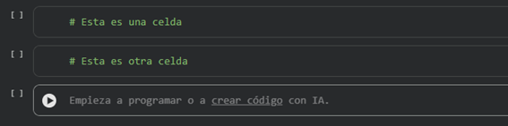

# Guía de Google Colab para principiantes

> Solo necesitas un navegador y una cuenta de Google para ejecutar programas en Python.

---

## ¿Qué es Google Colab?
Es un entorno de Python que corre directamente en el navegador.
No necesitas instalar nada, tu código se ejecuta en los servidores de Google.

**Cómo entrar:**
1. Ve a **colab.research.google.com**
2. Inicia sesión con tu cuenta de Google
3. Clic en **"Nuevo cuaderno"**
> Si te compartieron un archivo con terminación ```.ipynb``` puedes abrirlo en Colab dándole a subir cuaderno y eligiendo el archivo.

---

## Lo más importante que debes saber

### 1. Las celdas son tu área de trabajo
El código va en celdas grises.


Para ejecutar una celda tienes dos opciones:
- **Shift + Enter** → ejecuta y pasa a la siguiente celda
- Clic en el botón **▶** a la izquierda de la celda


---

### 2. El orden de ejecución importa
Las celdas no se comunican si no las ejecutas en orden.

* Celda 1: nombre = "Hugo"     ← debes ejecutar esta primero
* Celda 2: print(nombre)       ← si ejecutas esta sin la 1, da error

**Regla simple:** ejecuta siempre de arriba hacia abajo.

---

### 3. Si algo falla raro, reinicia
Menú: **Entorno de ejecución → Reiniciar entorno de ejecución**
Luego vuelve a ejecutar todas las celdas desde arriba.

---

### 4. Guardar tu trabajo
Colab guarda tu trabajo automáticamente en tu Google Drive.
Si quieres una copia local:
**Archivo → Descargar → Descargar .py**

---

## Errores frecuentes

| Error | Causa | Solución |
|---|---|---|
| `Runtime disconnected` | La sesión expiró por inactividad | Reconecta y vuelve a ejecutar las celdas |
| `NameError: name 'x' is not defined` | Ejecutaste una celda sin ejecutar las anteriores | Vuelve al inicio y ejecuta en orden |


---

## Atajos de teclado útiles

| Atajo | Acción |
|---|---|
| `Shift + Enter` | Ejecutar celda y pasar a la siguiente |
| `Ctrl + Enter` | Ejecutar celda y quedarse en ella |
| `Ctrl + M + B` | Crear nueva celda debajo |
| `Ctrl + M + A` | Crear nueva celda arriba |
| `Ctrl + M + D` | Eliminar celda actual |

---

> **Recuerda:** Colab es solo una alternativa temporal.
> Lo ideal es tener Python y VS Code instalados en tu computadora.